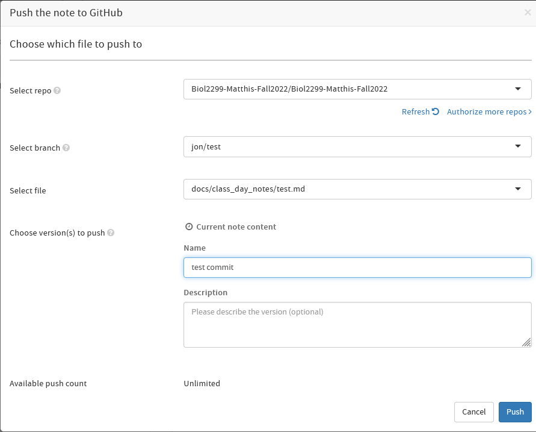

# How to create a pull request from HackMD

This guide will outline the steps to: 
- create a new note on `hackmd.io`
- push that note to a new branch on class GitHub repository

## Prerequisites
- a GitHub account
- a HackMD account
- 'Write access' to the GitHub repository

## 1. Create a new note by clicking the Green `+` button in the top left of the HackMD window

## 2. Give your note a title and add whatever content you want

## 3. Click the three dots "..." in the top right of the HackMD window

## 4. Select "Versions and GitHub Sync"

## 5. Click the "Push to GitHub" button 
 - If a window pops up about your line breaks, just say "Yes"

## 6. Fill out the information needed:

###  Set the "Select Repo" to `Biol2299-Matthis-Fall2022/Biol2299-Matthis-Fall2022`
 - If you don't see this repo, click the "Authorize more repos" button and follow the prompts there

###  Create a new "branch" on the GitHub repo to push your changes to
- The `main` branch of the repo is "protected," which means you can't push changes directly to it
- A "branch" is a place to stage changes so they can be reviewed by other people before being "merged" into `main`
- The name of the branch isn't super important (it will be deleted upon merge), but you can call it:
  - `[your_first_name]/[2-3_word_description_of_the_changes]`
  - 
### Select the path for the file you are pushing changes to
 - If you are making a new file, you can create it by specifying the path and filename, e.g
   - `docs/Shared Bibliography/this_cool_paper_summary.md`

###  Write a short description of the changes in the "Name"

### Push the "Push" button 
("Push" as in "push these changes into the Github Repo")

### That should be it!!

Your changes should now exist on a new branch on the GitHub repository :D
