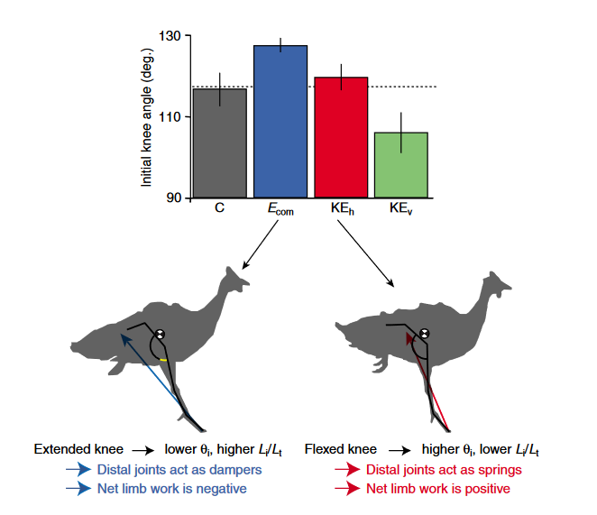
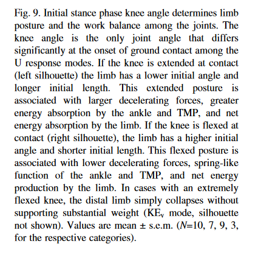

# Daley, M. A., Felix, G., & Biewener, A. A. (2007). Running stability is enhanced by a proximo-distal gradient in joint neuromechanical control. Journal of Experimental Biology, 210(4), 732–732. https://doi.org/10.1242/jeb.004226

## 1-2 sentence summary (in your own words)

[do it later]

## Method figure

[copy paste the main methods figure, if there is one]

## Main Results figure

[copy the (or one of the) main results figure ]

## Tags and Keywords 
[what species was studied? What tools were used? What kind of data did they get? What was the main topic?]

#guinea-fowl
#force-plate
#kinematic
#kinetic
#center-of-mass
#biomechanics
#