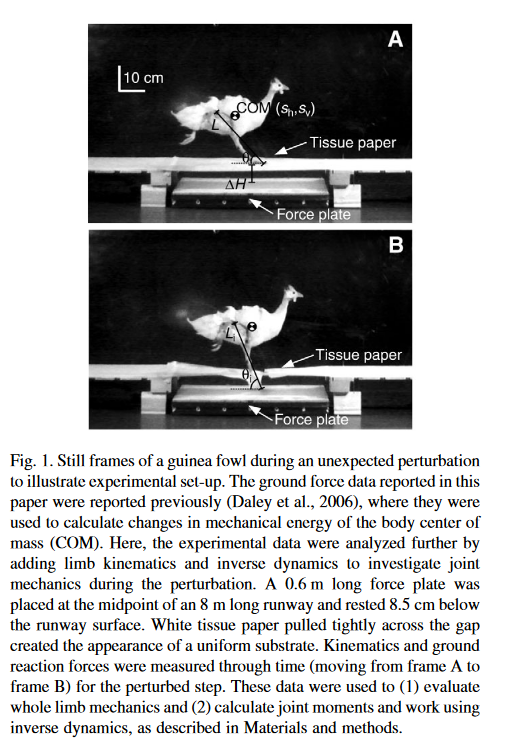
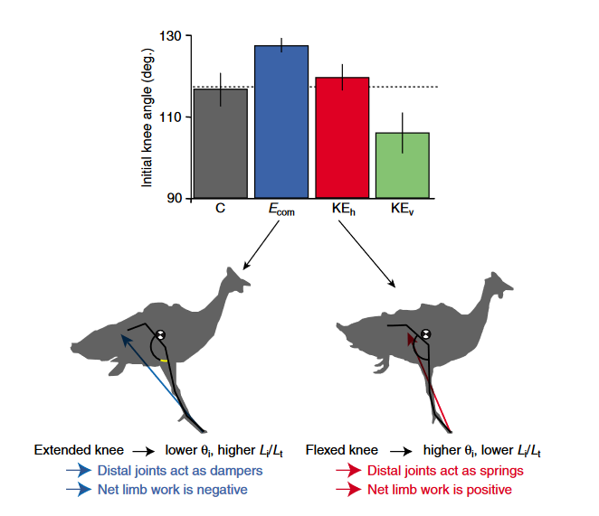

# (Daley et al., 2007)

## Citation (APA Format)

Daley, M. A., Felix, G., & Biewener, A. A. (2007). Running stability is enhanced by a proximo-distal gradient in joint neuromechanical control. Journal of Experimental Biology, 210(4), 732–732. https://doi.org/10.1242/jeb.004226

## Citation Nature Format

1. Daley, M. A., Felix, G. & Biewener, A. A. Running stability is enhanced by a proximo-distal gradient in joint neuromechanical control. Journal of Experimental Biology 210, 732–732 (2007).


## Brief Summary
```
 1. What did they do (what activities)? 
 2. What did they measure (what data)?
 3. What did they find (what results)?
 4. What does it mean (what new knowledge)?]
```
 1. Researchers had Guinea Fowl run across a runway with a false floor that caused an unexpected drop onto a force plate. 
 2. They measured the way that the bird's joints responded to the unexpected drop with motion capture (kinematics) and force plates (kinetics)
 3. They found that the lower joints (ankle and TMP) responded in a feedback-like way to the perturbation, but the bigger, more proximal joints continued their movements if the drop didn't happen.
 4. They suggest that proximal (hip, knee) and distal (ankle, TMP) joints respond to perturbations differently, which allows for more robust responses to unexpected pertrubations 

## Method figure
```
copy paste the main methods figure, if there is one]
```


## Main Results figure
`[copy the (or one of the) main results figure ]`



## Tags and Keywords 
```
[what species was studied? What tools were used? What kind of data did they get? What was the main topic?]
```

#guinea-fowl  
#force-plate  
#kinematic  
#kinetic  
#center-of-mass  
#biomechanics  
#